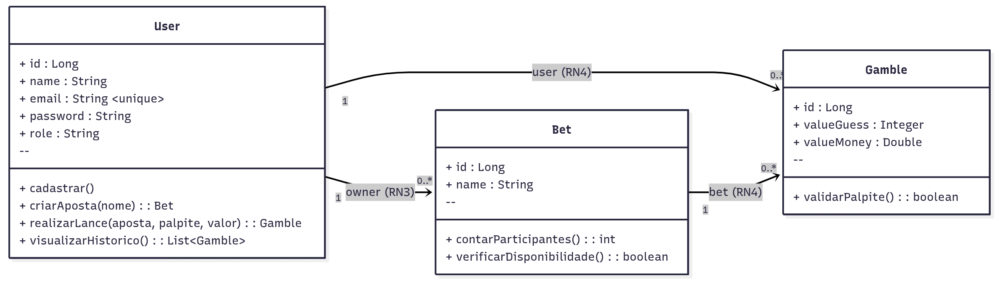

# Jogo-de-Dados-Poo-atividade

Atividade feita para a disciplina de poo na eaj em 2025 para aprender SpringBoot e Thymeleaf com PostgreSQL 

**REQUISITOS DE SISTEMA** 
- O sistema deverá permitir o cadastro de usuários
- O sistema deverá registrar a aposta em diferentes mesas
 **REGRAS DE NEGÓCIO** 
RN1: Usuário Único por E-mail: Cada usuário deve ter um endereço de e-mail exclusivo, garantindo que não haja duplicidade de contas.
RN2: Segurança da Conta: Todo usuário deve ter uma senha e um e-mail cadastrado para acesso.
RN3: Participação em Apostas: Uma aposta é sempre criada por um usuário, estabelecendo a autoria da mesa ou evento de aposta.
RN4: Realização de Lances: Um lance é sempre associado a uma aposta específica e realizado por um usuário, indicando quem está apostando e em qual evento.
RN5: Conteúdo do Lance: Um lance deve conter obrigatoriamente um palpite e um valor monetário apostado.
RN6: Integridade Referencial: A exclusão ou atualização de um registro de usuário ou aposta deve propagar as alterações para as tabelas relacionadas, garantindo que não existam dados órfãos.
RN7:	Limite de Participantes por Aposta: Uma aposta deve ter um número mínimo de 2 usuários e um número máximo de 11 usuários participantes.
RN8:	Restrição de Palpite: O valor do palpite em qualquer lance deve ser um número inteiro entre 2 e 12, inclusos.

 **CASOS DE USO** 
CU1:	Cadastrar Novo Usuário: O Jogador registra uma nova conta no sistema, fornecendo nome, e-mail, e senha.
CU2:	Criar Nova Aposta (Mesa):	O Jogador inicia um novo evento de aposta, dando-lhe um nome.
CU3:	Realizar um Lance:	O sistema agora deve validar se o palpite submetido está no intervalo permitido (entre 2 e 12). Se estiver fora desse intervalo, o lance deve ser recusado.
CU4:	Visualizar Apostas Disponíveis:	O Jogador consulta a lista de apostas criadas, para escolher em qual participar.
CU5:	Visualizar Histórico de Lances:	O Jogador consulta todos os lances que ele já realizou.

## Diagrama de Classes (UML)

## Diagrama de Casos de Uso

